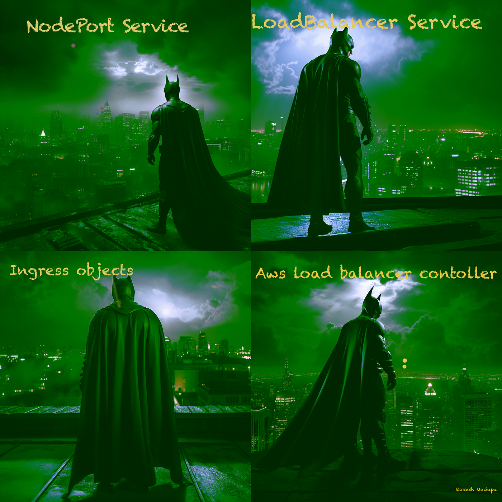

### Postmortem: Facebook Server Outage

#### Issue Summary
**Duration of Outage:**  
Start: June 7, 2024, 10:00 AM (UTC)  
End: June 7, 2024, 11:30 AM (UTC)  

**Impact:**  
Facebook's main service was completely inaccessible to users globally. Approximately 85% of users experienced a total outage, unable to load the website or app, while 15% reported significant slowdowns and intermittent access issues. Business operations relying on Facebook APIs were also disrupted, affecting numerous third-party applications.

**Root Cause:**  
The outage was traced back to a misconfiguration in a load balancer update, which caused a cascading failure across multiple data centers.

---

#### Timeline

- **10:00 AM:** Issue detected by automated monitoring systems, followed by a surge in user complaints on other social media platforms.
- **10:05 AM:** Initial investigation began, focusing on the most recent changes deployed.
- **10:10 AM:** Network team notified of potential load balancer issues; began assessing recent updates.
- **10:20 AM:** Incorrect assumptions led to investigating potential DDoS attack vectors.
- **10:30 AM:** Further analysis redirected focus back to the load balancer configurations.
- **10:40 AM:** Escalation to senior network engineers and data center operations team.
- **10:50 AM:** Identified the misconfiguration in the load balancer settings.
- **11:00 AM:** Initiated rollback procedures to revert to previous stable configuration.
- **11:20 AM:** Rollback completed; services began to restore.
- **11:30 AM:** Full service restoration confirmed.

---

#### Root Cause and Resolution

**Root Cause:**  
A recent update to the load balancer included a misconfiguration that inadvertently directed traffic in a loop between data centers. This misconfiguration caused the load balancers to become overwhelmed, leading to a cascading failure that propagated through Facebook's network infrastructure. The load balancers could not distribute traffic efficiently, causing the entire service to become unresponsive.

**Resolution:**  
The issue was resolved by rolling back the load balancer configuration to its previous state. Once the rollback was initiated, traffic routing began to normalize, allowing services to recover gradually. Additional checks and tests were performed to ensure the stability of the system before declaring the incident resolved.

---

#### Corrective and Preventative Measures

**Improvements and Fixes:**
1. **Enhanced Configuration Validation:** Implement more rigorous validation checks for load balancer configurations before deployment.
2. **Improved Monitoring and Alerts:** Develop more granular monitoring tools to detect early signs of traffic anomalies and misconfigurations.
3. **Automated Rollback Mechanism:** Create automated rollback mechanisms for critical infrastructure components to minimize downtime in case of similar issues.

**Tasks:**
- **Task 1:** Update the load balancer configuration deployment pipeline to include enhanced validation checks.
- **Task 2:** Implement detailed monitoring and alerting for load balancer traffic patterns and anomalies.
- **Task 3:** Develop and test automated rollback procedures for critical network infrastructure components.
- **Task 4:** Conduct a review and training session with the network engineering team on the new processes and tools.
- **Task 5:** Schedule regular audits of load balancer configurations and deployment practices.

---

#### Conclusion
This incident highlighted the critical importance of robust configuration management and rapid incident response mechanisms. While the outage was resolved within a relatively short timeframe, the impact on users and businesses underscored the need for continual improvement in both our infrastructure and our operational procedures. By implementing the corrective and preventative measures outlined above, we aim to mitigate the risk of similar incidents in the future and enhance the overall resilience of our services.

*Source: Rakesh Madupu*